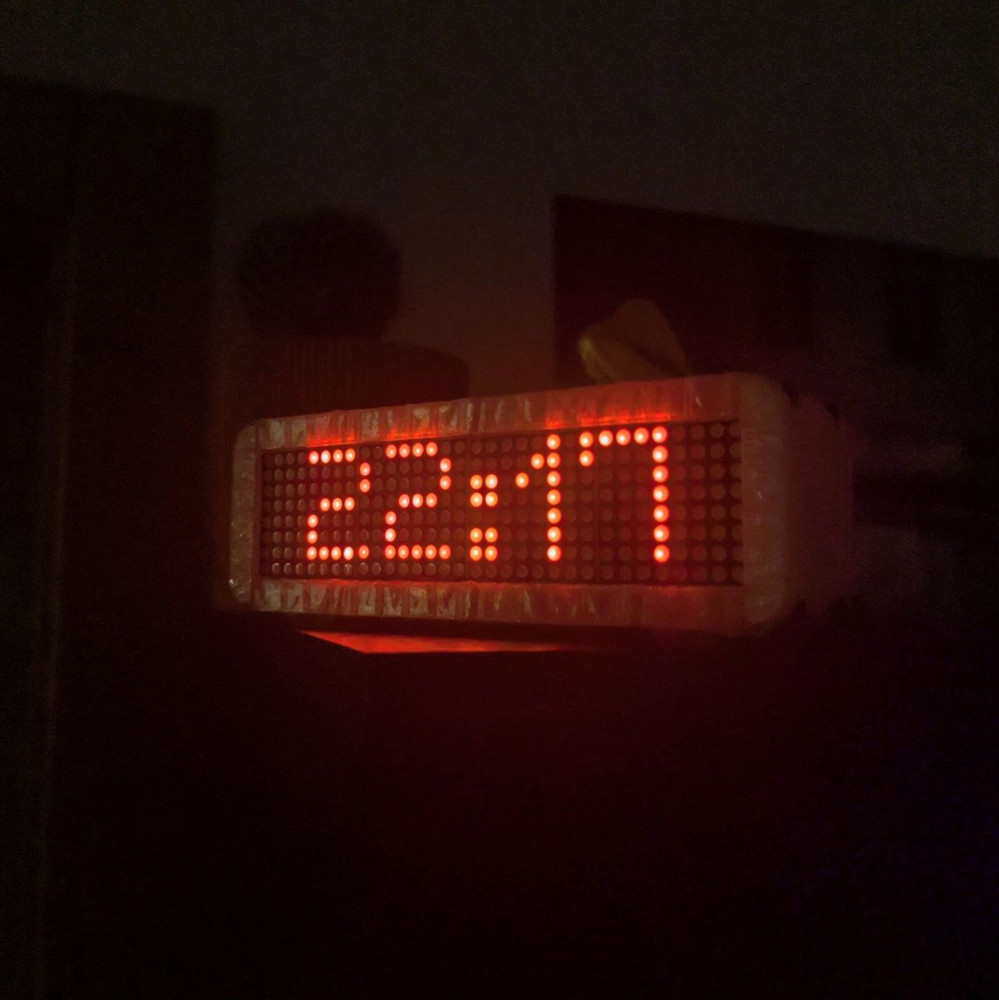
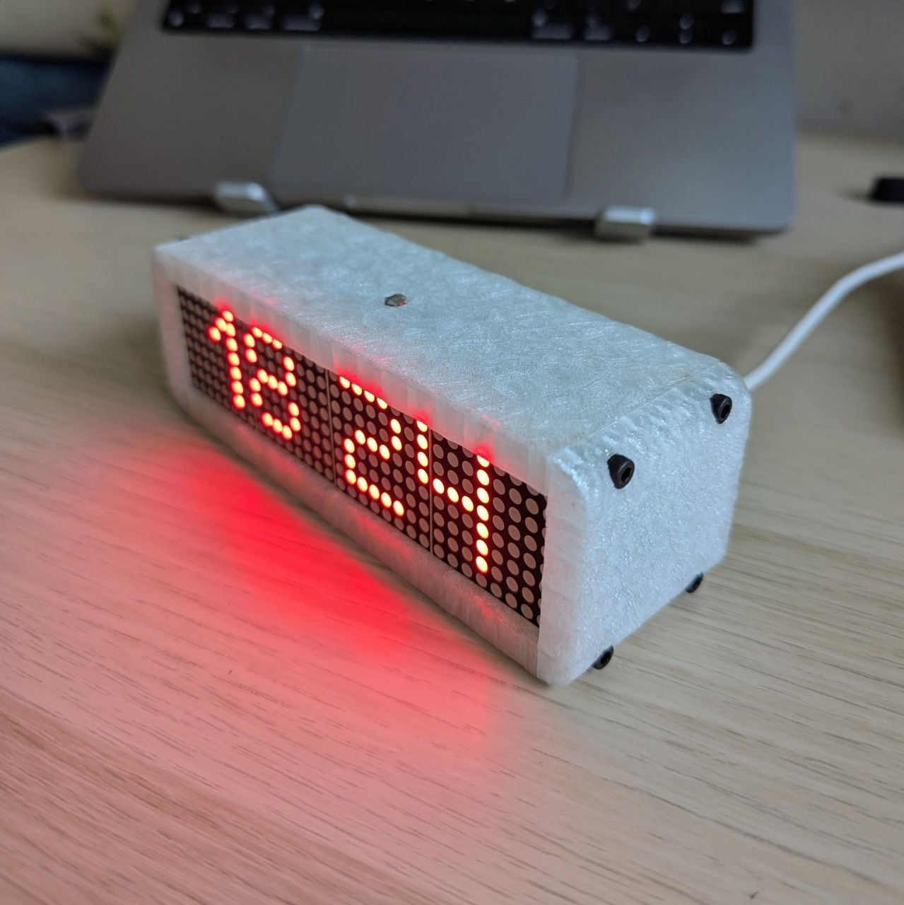
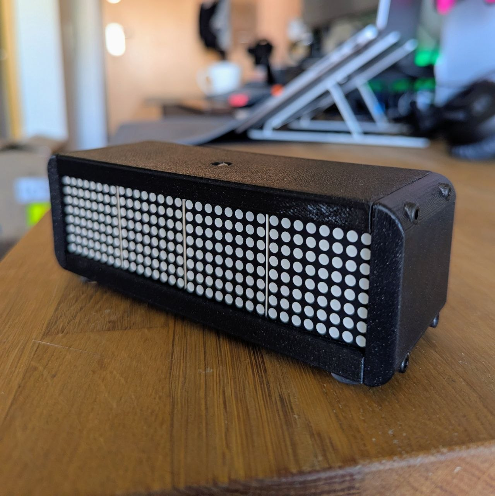
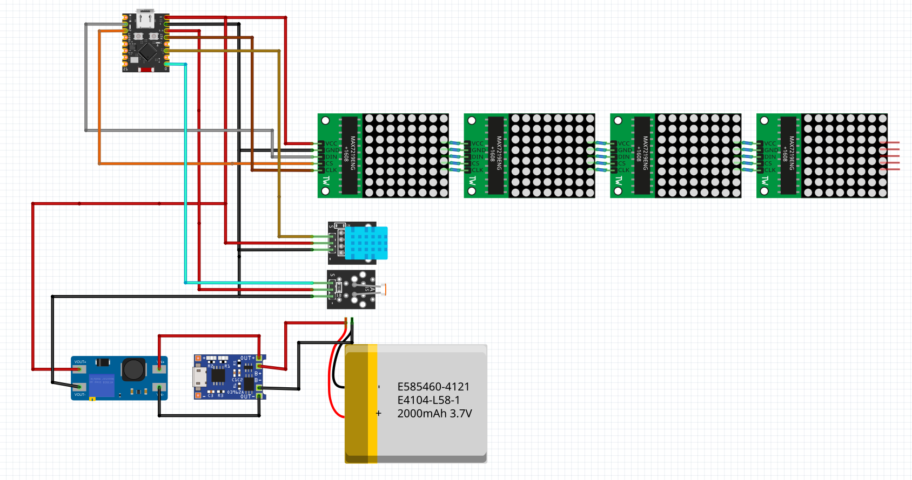

# ESP32-C3 Mini LED Clock with DHT22

A smart LED dot-matrix clock built on ESP32-C3 Mini with a 4-module MAX7219 display, DHT22 temperature/humidity sensor, and KY-018 photoresistor for auto-brightness.

WiFi is used only for NTP time sync on boot, then disconnected to save power.



**3D Model:** [MakerWorld link here]

## Gallery

| Daylight | Night Glow | Case |
|----------|------------|------|
|  |  |  |

## Features

- **NTP Clock** -- auto-synced time with 7-segment font, flashing colon separator
- **DHT22 Sensor** -- temperature and humidity displayed in rotation
- **Auto Brightness** -- KY-018 photoresistor adjusts display based on ambient light
- **Night Sleep Mode** -- display and WiFi off between 00:00--08:00, wakes up automatically
- **Animated Transitions** -- scroll, mesh, blinds, and grow effects between screens
- **Boot Animation** -- dot loader and status messages during WiFi/NTP connection
- **Low Power** -- WiFi disconnects after NTP sync, reconnects only on wake
- **Built-in LED** -- ESP32-C3 onboard LED always on as status indicator

## Display Cycle

| Phase | Content | Duration |
|-------|---------|----------|
| 1 | Clock (HH:MM) | 60 seconds |
| 2 | Day & date (e.g. "Mon 14") | ~3 seconds |
| 3 | Temperature (e.g. "T: 23 C") | ~3 seconds |
| 4 | Humidity (e.g. "H: 45 %") | ~3 seconds |

## Wiring



### Pinout

| Component | Pin |
|-----------|-----|
| MAX7219 CLK | GPIO 4 |
| MAX7219 DATA | GPIO 6 |
| MAX7219 CS | GPIO 7 |
| DHT22 DATA | GPIO 2 |
| KY-018 (photoresistor) | GPIO 0 (ADC) |
| Built-in LED | GPIO 8 |

### Components

- ESP32-C3 Mini
- 4x MAX7219 8x8 LED matrix modules (FC16 type)
- DHT22 temperature & humidity sensor
- KY-018 photoresistor module

## Setup

1. Install [Arduino IDE](https://www.arduino.cc/en/software)
2. Add ESP32 board support: File -> Preferences -> Additional Board URLs:
   ```
   https://espressif.github.io/arduino-esp32/package_esp32_index.json
   ```
3. Install libraries via Library Manager:
   - **MD_Parola**
   - **MD_MAX72XX** (installed with MD_Parola)
   - **DHT sensor library** (Adafruit)
4. Open `esp32-mini-max7219-clock/esp32-mini-max7219-clock.ino`
5. Edit your WiFi credentials:
   ```cpp
   const char* ssid     = "YOUR_WIFI_SSID";
   const char* password = "YOUR_WIFI_PASSWORD";
   ```
6. Set your timezone ([list of timezone strings](https://github.com/nayarsystems/posix_tz_db/blob/master/zones.csv)):
   ```cpp
   const char* TIMEZONE_STRING = "WET0WEST,M3.5.0/1,M10.5.0";
   ```
7. Select board: **Tools -> Board -> ESP32C3 Dev Module**
8. Upload

## Configuration

### Sleep Schedule

```cpp
#define NIGHT_HOUR_START 0   // sleep at 00:00
#define NIGHT_HOUR_END   8   // wake at 08:00
```

### Brightness

```cpp
const int LDR_DARK_THRESHOLD = 3000;  // adjust for your LDR
const int MAX_BRIGHTNESS = 8;
const int MIN_BRIGHTNESS = 1;
```

### Sensor Interval

```cpp
#define SENSOR_UPDATE_INTERVAL 900000UL  // 15 minutes
```

## License

MIT
